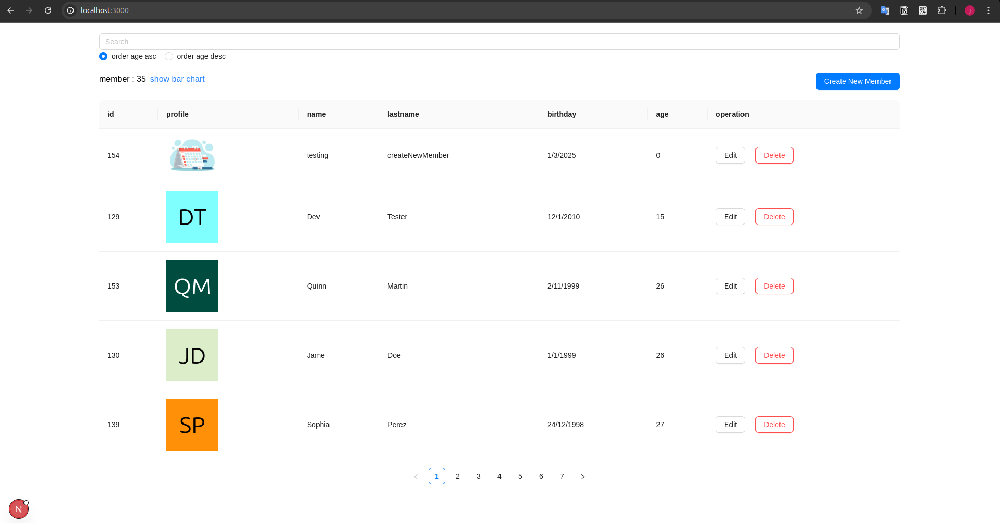
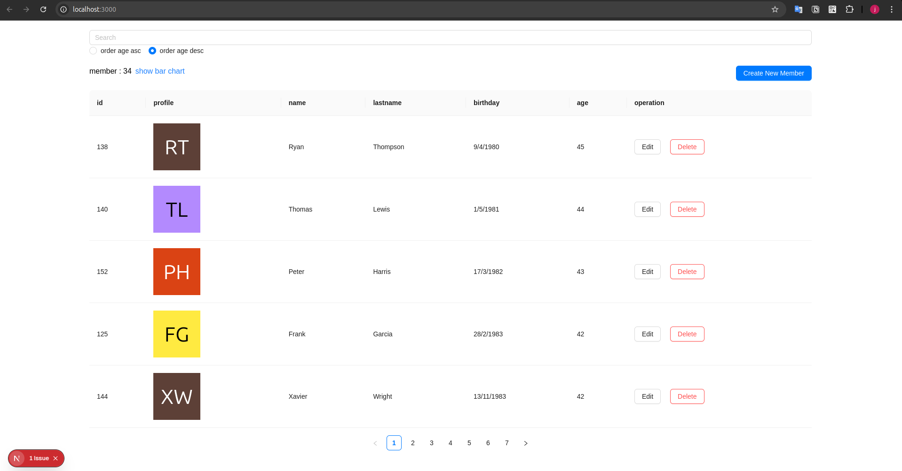
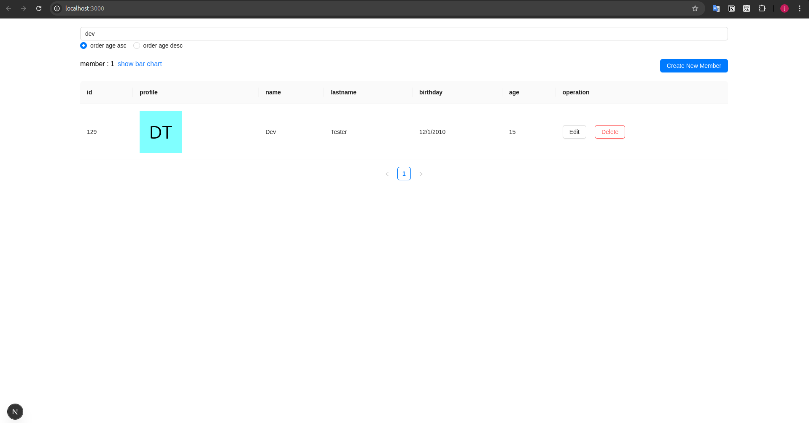
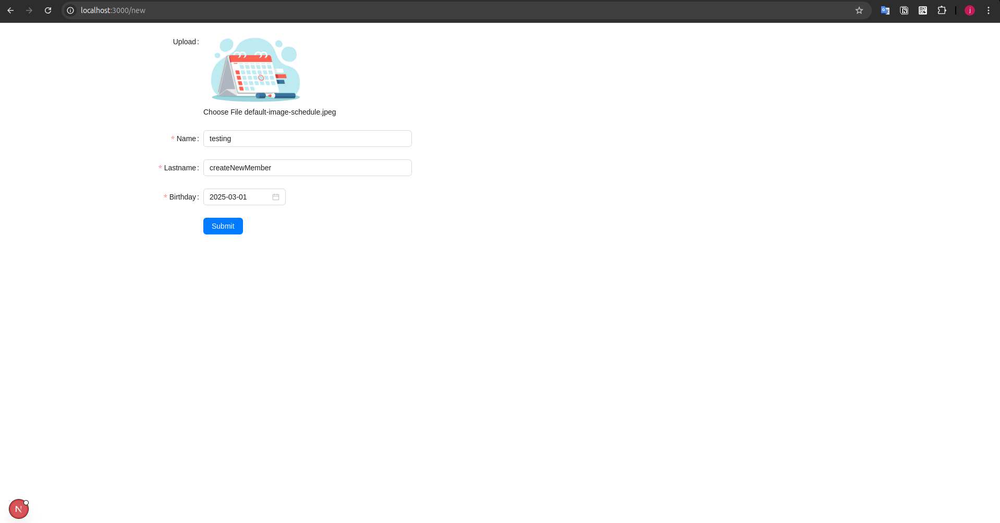
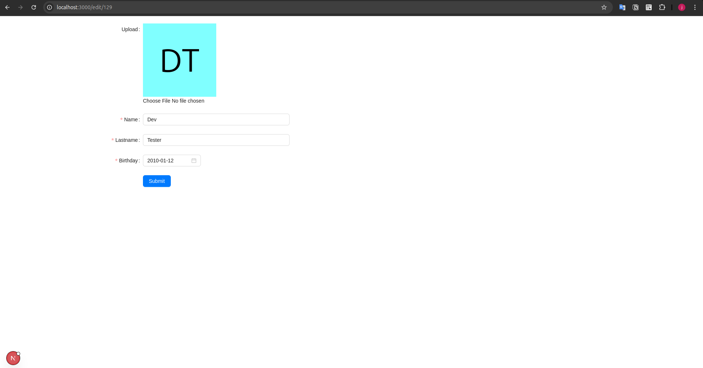
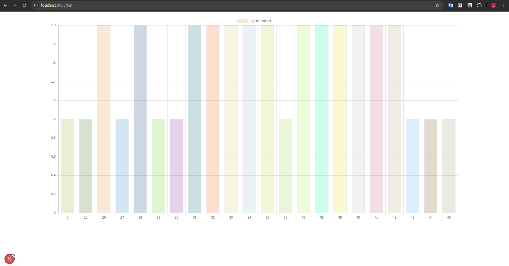
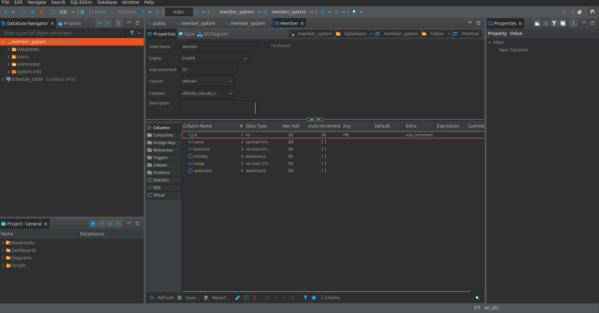

review result assignment

tech-stack 
  - languege : typescript languege
  - back-end : express + prisma orm (db: mysql)
  - front-end : next-js + ant_ui + chartjs + tailwind css
  - database : mysql

Web application

thank you for your attention.
